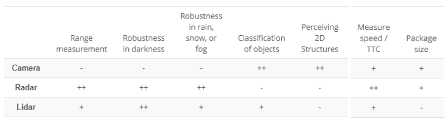
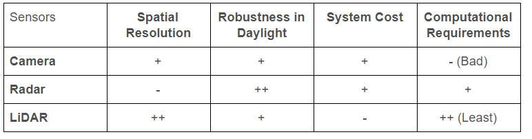
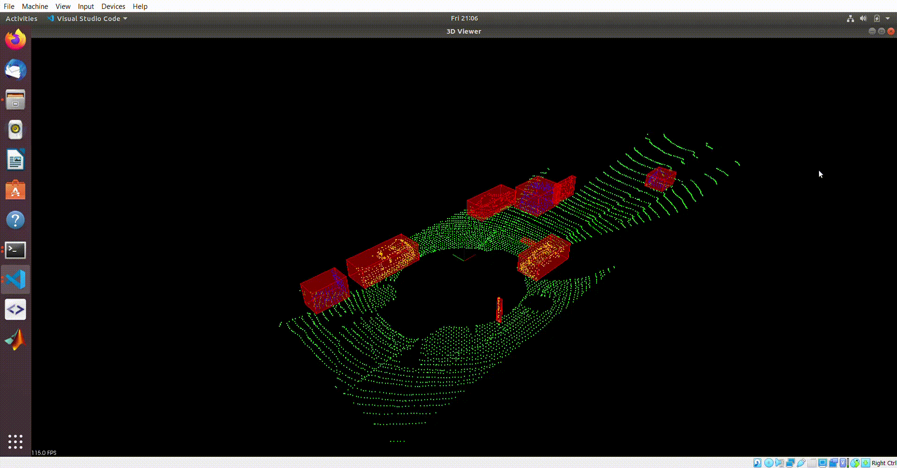
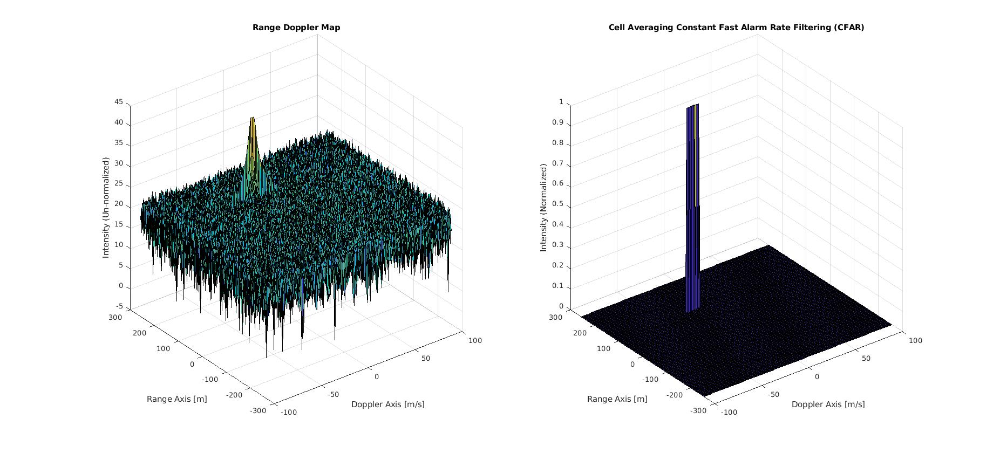

# Sensor Fusion Nanodegree (Udacity)

**Disclaimer:** Udacity provided some starter code, but the implementation for these concepts are done by myself. Please contact derektan95@hotmail.com for any questions. 

### Certificate of Completion 
https://graduation.udacity.com/nd313

### Summary 
This is a course that summarizes the essential principles of **LiDAR, Camera, Radar and Sensor Fusion**. Since each sensor has their inherent strengths and limitations, it is important to investigate how they can complement each other to provide the most reliable results when attempting to determine the position and velocity of obstacles.

**Note:** These projects are developed in **Ubuntu 18.04**, **ROS Melodic**, **PCL 1.8** and **OpenCV2**. Please clone the `master` branch for latest version of all projects. The `with_cmake_files` branch contains cmake files from my computer, which will be irrelevant for you. All projects are compiled using cmake (https://cmake.org/).

## LiDAR Segment - Point Cloud Library 
The **Random Sample Consensus (RANSAC)** principle was used to segment the ground plane from point cloud data. Obstacle Clustering was performed using recursion, with improved efficiency using the **Kd-tree data structure**.

The main principles taught in this segment are: 
1) Plane Segmentation
2) Euclidean Clustering using kd-tree
3) Filtering techniques
4) Reading and streaming PCDs

## Camera Segment - OpenCV 
The **YOLO v3 Object Recognition framework** was utilized to assign bounding boxes to potential targets. Corresponding bounding boxes were matched between consecutive images using keypoint Detectors and Descriptors. Accuracy and speed analysis test were conducted for different combinations of keypoint Detectors and Descriptors. For the referenced image above, the **Shi-Tomasi Detector** was used along with the **BRIEF Descriptor**. The Time-To-Collision value was calculated either with Lidar or camera keypoint values. **Keypoint detectors / descriptors used: SHI-TOMASI, HARRIS, FAST, BRISK, ORB, AKAZE, SIFT.** 

The main principles taught in this segment are: 
1) Camera Technology & Optics
2) Autonomous Vehicles & Computer Vision 
3) Engineering a Collision Detection System (Time To Collision)
4) Tracking Image Features (Detectors, Descriptors, Matchers, Selectors)
5) Introduction to Object Detection Frameworks - YOLO
6) Sensor Fusion - Camera + LiDAR

## Radar Segment - Matlab 
**Fast Fourier Transform** was performed twice on readings given by the **Frequency Modulated Continuous Wave (FMCW) Radar** to obtain the **Range-Doppler Map**.  Furthermore, **Cell Averaging Constant Fast Alarm Rate (CA - CFAR)** was conducted to dynamically filter out noise and to retrieve the peak corresponding to the obstacle. From the image below, one can deduce that the obstacle has a displacement of 110m and a velocity of -20m/s.

The main principles taught in this segment are: 
1) Radar Principles
2) Using Fast-Fourier Transform to obtain Range (Distance) and Doppler (Velocity) information
3) Removing clutter (noise) using Cell Averaging Constant Fast Alarm Rate (CA-CFAR)
4) Clustering and Tracking of Radar points
5) Simulation on Matlab

## Kalman Filter Segment 
The **Unscented Kalman Filter** takes in noisy measurement data as input and provides a robust estimation of displacement and velocity values of obstacles. The **Constant Turn Rate and Velocity Magnitude Model (CTRV) model** is used to provide predictions of future state of obstacle, which is then weighted against sensor readings to provide reliable estimations that minimizes prediction or sensor error. In the image referenced below, the green path represents the predicted path by the Kalman Filter. The Root Mean Squared Error (RMSE) between estimation and ground truth values is successfully minimized.

The main principles taught in this segment are: 
1) Normal Kalman Filter (1D)
2) Extended Kalman Filter (2D)
3) Unscented Kalman Filter (2D)

